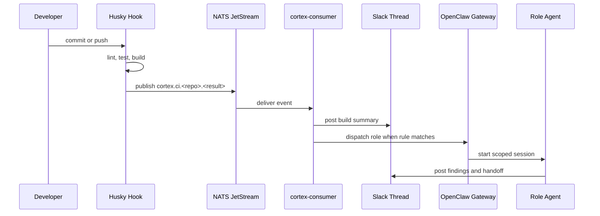

# CortexOS Architecture

> System design for prompt-driven infrastructure, event orchestration, secure credentials, and agent operations.

## Contents

- [Design principles](#design-principles)
- [Layer model](#layer-model)
- [Runtime topology](#runtime-topology)
- [Event flow](#event-flow)
- [Data stores](#data-stores)
- [Security boundaries](#security-boundaries)
- [Port map](#port-map)
- [Extension points](#extension-points)
- [Related docs](#related-docs)

## Design principles

1. **Operator remains authority**: Prompts pause at checkpoints. Agents propose and execute; humans verify.
2. **NATS carries machine events**: All orchestration events use explicit `cortex.*` subjects.
3. **Slack carries human narrative**: Threads preserve context, decisions, approvals, and handoffs.
4. **Filesystem remains transparent**: Compose stacks, systemd units, and role prompts are plain files under `CORTEX_ROOT`.
5. **Secrets stay constrained**: Reads use allowlists, values are masked, and dashboard storage is encrypted.
6. **Agents are roles plus dispatch rules**: New behavior is added through Markdown role files and routing config, not service sprawl.

## Layer model

```text
Layer 7  Dashboard and operator UX        Next.js, Caddy, Slack, Telegram
Layer 6  Agent factory                    role files, labels, dispatch state
Layer 5  AI platform                      OpenClaw, 9Router, AgentGateway, LEANN
Layer 4  Application services             Home Assistant, Jellyfin, project bots
Layer 3  Observability                    Prometheus, Loki, Grafana, exporters
Layer 2  Infrastructure                   PostgreSQL, Redis, MongoDB, NATS, Caddy
Layer 1  VPS base                         Ubuntu, Docker, systemd, Tailscale, firewall
```

## Runtime topology

```text
Developer workstation
  ├─ Husky hooks
  ├─ Git operations
  └─ NATS event publisher
          │
          v
NATS JetStream ──▶ cortex-consumer ──▶ Slack thread
     │                    │
     │                    └──────────▶ OpenClaw Gateway ──▶ scoped agent session
     │
     └──────────────────▶ Dashboard event views

Dashboard ──▶ PostgreSQL
Dashboard ──▶ allowlisted VPS files
Dashboard ──▶ service health endpoints
Dashboard ──▶ confirmation tokens for privileged actions
```

## Event flow



## Data stores

| Store | Purpose | Durability | Owner |
|---|---|---|---|
| PostgreSQL | Dashboard users, services, credentials metadata, audits | Persistent | Dashboard |
| NATS JetStream | Operational event stream | Short retention | Orchestration |
| Slack | Human-readable operational record | Workspace retention | Operator |
| Filesystem | Stacks, scripts, secrets, volumes, role files | Host persistent | Operator |
| LEANN | Memory and retrieval index | Host persistent | AI platform |

## Security boundaries

| Boundary | Control |
|---|---|
| Public internet to dashboard | Caddy, authentication, TLS, least exposed routes |
| Dashboard to host files | Path allowlist, masking, audit events, confirmation tokens |
| Agent to privileged action | Role prompt, dispatch scope, human approval, logs |
| Secrets at rest | `.secrets/` permissions and AES-256-GCM in dashboard DB |
| Service network | Docker bridge isolation and explicit host mappings |

## Port map

| Port | Service | Notes |
|---:|---|---|
| 80 / 443 | Caddy | HTTP(S) ingress |
| 3080 | Dashboard | Next.js production server |
| 4222 / 8222 | NATS | Client and monitoring endpoints |
| 5432 | PostgreSQL | Dashboard database |
| 6379 | Redis | Infrastructure cache |
| 9090 | Prometheus | Metrics database |
| 3100 | Grafana | Dashboards |
| 3200 | Loki | Logs API |
| 15021 | AgentGateway | Readiness endpoint |
| 18789 | OpenClaw Gateway | Agent dispatch API |
| 11434 | 9Router | Model routing API (OpenAI-compatible) |

## Extension points

- Add service: create compose stack, add dashboard seed row, add health check, document runbook.
- Add NATS subject: update contract, consumer route, Slack rendering, tests.
- Add agent role: add role file, label workflow, dispatch rule, review policy.
- Add credential: define source file, import slug, rotation owner, masking policy.

## Related docs

- [docs/ARCHITECTURE.md](docs/ARCHITECTURE.md)
- [docs/NATS-CONTRACT.md](docs/NATS-CONTRACT.md)
- [docs/AGENT_FACTORY.md](docs/AGENT_FACTORY.md)
- [docs/SECURITY.md](docs/SECURITY.md)
