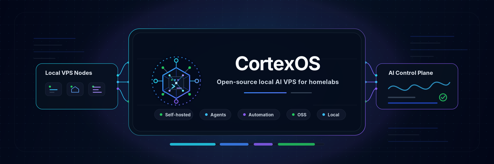

<p align="center">
  
</p>

<h1 align="center">CortexOS</h1>

<p align="center">
  <strong>Your own AI infrastructure, on your own server.</strong>
</p>

<p align="center">
  <a href="docs/INSTALL-WITH-AI.md">🚀 Install</a> •
  <a href="docs/TOOLS.md">🔧 Tools</a> •
  <a href="docs/GUIDE.md">📖 Docs</a> •
  <a href="docs/ARCHITECT.md">🤖 The Architect</a> •
  <a href="CONTRIBUTING.md">🛠️ Contribute</a>
</p>

---

## What is CortexOS?

CortexOS is a **complete, self-hosted AI infrastructure platform** that runs on a single Ubuntu server. Instead of paying for multiple cloud services, you own and control everything — AI models, databases, monitoring, and a web dashboard — all in one place.

**Built for:**
- 🤖 **AI enthusiasts** who want their own AI stack
- 🏢 **Small teams** who need private infrastructure
- 🔒 **Privacy-focused users** who don't want data leaving their server
- 🧑‍💻 **Developers** who want a production-ready platform to build on

---

## What You Get

| Feature | What It Means |
|---------|--------------|
| 🤖 **AI Gateway** | Access Claude, GPT, Gemini, and local models through one API |
| 🧠 **AI Memory** | Your AI remembers conversations and builds knowledge over time |
| 💾 **Databases** | PostgreSQL, Redis, MongoDB, MySQL — ready to use |
| 📊 **Monitoring** | See CPU, memory, disk, and logs in beautiful dashboards |
| 🌐 **Web Dashboard** | Control everything from your browser |
| 🔒 **Secure VPN** | Access your server safely from anywhere via Tailscale |
| 🏗️ **Developer Tools** | Code sandbox, file manager, terminal — all built in |

---

## 🚀 Quick Start

### The Easy Way (Recommended)

1. **Rent a server** — Ubuntu 24.04, 4GB RAM, 50GB disk ([Hetzner](https://www.hetzner.com/cloud), [DigitalOcean](https://www.digitalocean.com), [OVH](https://www.ovhcloud.com))
2. **Connect via SSH** — `ssh root@your-server-ip`
3. **Clone this repo**:
   ```bash
   cd /opt && git clone https://github.com/bloodf/cortexos.git && cd cortexos
   ```
4. **Follow the AI installer** — copy prompts from [`prompts/tools/_order.md`](prompts/tools/_order.md) into Claude, ChatGPT, or any AI assistant

📖 [**Beginner's Install Guide →**](docs/INSTALL-WITH-AI.md)

### The Manual Way

Already comfortable with Linux? See the operator install guide:

📖 [**Manual Install Guide →**](docs/INSTALL.md)

---

## 🔧 Tools Included

CortexOS installs **25+ tools** across your server. Here's what's included:

### Core Infrastructure
| Tool | Description | Links |
|------|-------------|-------|
| **tmux** | Terminal session persistence | [GitHub](https://github.com/tmux/tmux) · [Website](https://tmux.github.io) |
| **Docker** | Container runtime | [Docs](https://docs.docker.com) · [GitHub](https://github.com/docker/docker-ce) |
| **Caddy** | Reverse proxy with automatic HTTPS | [Website](https://caddyserver.com) · [GitHub](https://github.com/caddyserver/caddy) |

### Databases
| Tool | Description | Links |
|------|-------------|-------|
| **PostgreSQL** | Primary relational database | [Website](https://postgresql.org) · [GitHub](https://github.com/postgres/postgres) |
| **Redis** | In-memory cache and sessions | [Website](https://redis.io) · [GitHub](https://github.com/redis/redis) |
| **MongoDB** | Document database *(optional)* | [Website](https://mongodb.com) · [GitHub](https://github.com/mongodb/mongo) |
| **MySQL** | Relational database *(optional)* | [Website](https://mysql.com) · [GitHub](https://github.com/mysql/mysql-server) |

### Observability
| Tool | Description | Links |
|------|-------------|-------|
| **Prometheus** | Metrics collection | [Website](https://prometheus.io) · [GitHub](https://github.com/prometheus/prometheus) |
| **Grafana** | Dashboards and visualization | [Website](https://grafana.com) · [GitHub](https://github.com/grafana/grafana) |
| **Loki** | Log aggregation | [Website](https://grafana.com/oss/loki) · [GitHub](https://github.com/grafana/loki) |
| **Fluent Bit** | Log forwarder | [Website](https://fluentbit.io) · [GitHub](https://github.com/fluent/fluent-bit) |
| **cAdvisor** | Container metrics | [GitHub](https://github.com/google/cadvisor) |
| **Node Exporter** | Host metrics | [GitHub](https://github.com/prometheus/node_exporter) |

### AI & Agents
| Tool | Description | Links |
|------|-------------|-------|
| **Model endpoint** | OpenAI-compatible chat endpoint (configure per profile) | *external or local* |
| **Hindsight** | Self-hosted AI memory backend (primary) | [GitHub](https://github.com/vectorize-io/hindsight) |
| **Honcho** | Memory backend (legacy, read-only) | [GitHub](https://github.com/plastic-labs/honcho) |
| **Memory OS** | Long-term AI memory | [GitHub](https://github.com/ClaudioDrews/memory-os) |
| **Cortex Sandbox** | Safe code execution (internal) | *CortexOS component* |
| **Obot** | MCP gateway platform (internal) | *CortexOS component* |

### Developer Tools
| Tool | Description | Links |
|------|-------------|-------|
| **fzf** | Fuzzy finder for files and commands | [GitHub](https://github.com/junegunn/fzf) |
| **BoxBox** | Web-based file manager | [GitHub](https://github.com/jR4dh3y/BoxBox) |
| **herdr** | Terminal workspace manager for AI coding agents | [Website](https://herdr.dev) |

### Admin UIs
| Tool | Description | Links |
|------|-------------|-------|
| **pgAdmin** | PostgreSQL admin panel | [Website](https://pgadmin.org) · [GitHub](https://github.com/postgres/pgadmin4) |
| **RedisInsight** | Redis browser and admin | [Website](https://redis.io/insight) · [GitHub](https://github.com/RedisInsight/RedisInsight) |
| **Mongo Express** | MongoDB admin interface | [GitHub](https://github.com/mongo-express/mongo-express) |
| **phpMyAdmin** | MySQL/MariaDB admin | [Website](https://phpmyadmin.net) · [GitHub](https://github.com/phpmyadmin/phpmyadmin) |

### Platform
| Tool | Description | Links |
|------|-------------|-------|
| **CortexOS Dashboard** | Web control panel (internal) | *CortexOS component* |
| **Incus** | Per-project containers | [Website](https://linuxcontainers.org/incus) · [GitHub](https://github.com/lxc/incus) |
| **Mail Guardian** | IMAP spam filter (internal) | *CortexOS component* |

👉 See the full catalog with detailed descriptions: [`docs/TOOLS.md`](docs/TOOLS.md)

---

## 🏗️ Architecture

```
┌─────────────────────────────────────────┐
│              YOUR SERVER                │
│                                         │
│  ┌──────────────┐  ┌──────────────┐    │
│  │    Caddy     │  │   Dashboard  │    │
│  │  (Web Proxy) │  │   (Control)  │    │
│  └──────┬───────┘  └──────────────┘    │
│         │                               │
│  ┌──────┴───────────────────────┐      │
│  │      Docker Services         │      │
│  │  ┌────────┐ ┌────────┐      │      │
│  │  │PostgreSQL│ │ Redis  │      │      │
│  │  └────────┘ └────────┘      │      │
│  │  ┌────────┐ ┌────────┐      │      │
│  │  │Prometheus│ │ Grafana│      │      │
│  │  └────────┘ └────────┘      │      │
│  └──────────────────────────────┘      │
│                                         │
│  ┌──────────────────────────────┐      │
│  │         AI Stack             │      │
│  │  LLM endpoint → Models → Memory   │      │
│  └──────────────────────────────┘      │
└─────────────────────────────────────────┘
```

---

## 📚 Documentation

| I want to... | Go here |
|-------------|---------|
| **Understand what CortexOS is** | [`docs/GUIDE.md`](docs/GUIDE.md) |
| **Install for the first time** | [`docs/INSTALL-WITH-AI.md`](docs/INSTALL-WITH-AI.md) |
| **See all tools with links** | [`docs/TOOLS.md`](docs/TOOLS.md) |
| **Learn how the AI installer works** | [`docs/ARCHITECT.md`](docs/ARCHITECT.md) |
| **Set up AI models** | [`docs/AI-SETUP.md`](docs/AI-SETUP.md) |
| **Configure secrets** | [`docs/SECRETS.md`](docs/SECRETS.md) |
| **Fix a problem** | [`docs/TROUBLESHOOTING.md`](docs/TROUBLESHOOTING.md) |
| **Browse all docs** | [`docs/README.md`](docs/README.md) |

---

## 🛠️ For Developers

- **Contributing:** See [`CONTRIBUTING.md`](CONTRIBUTING.md)
- **Agent Instructions:** See [`AGENTS.md`](AGENTS.md) (for AI agents working on this repo)
- **Local Development:** `pnpm install && pnpm dev` in `packages/dashboard/`

---

## 🔐 Security

- Secrets are encrypted with [SOPS](https://github.com/getsops/sops) + [age](https://age-encryption.org) — never commit plaintext
- All web traffic goes through [Tailscale](https://tailscale.com) VPN
- Untrusted code runs in a [gVisor](https://gvisor.dev) sandbox
- See [`docs/SECRETS.md`](docs/SECRETS.md) and [`SECURITY.md`](SECURITY.md)

---

## 📝 License

See [`LICENSE`](LICENSE)

---

## 💬 Community

- **Issues:** [GitHub Issues](https://github.com/bloodf/cortexos/issues)
- **Discussions:** [GitHub Discussions](https://github.com/bloodf/cortexos/discussions)

---

> **Ready to build your own AI infrastructure?** Start with the [beginner's install guide](docs/INSTALL-WITH-AI.md).
