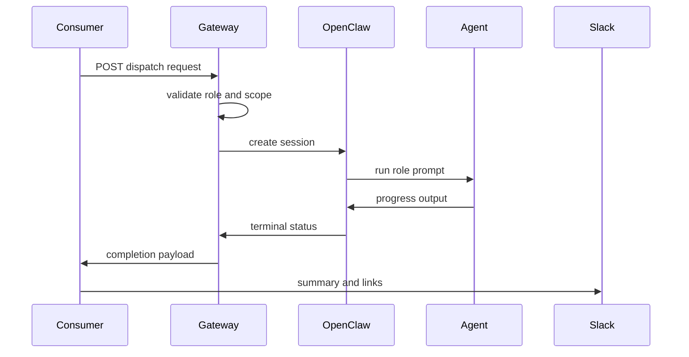

# CortexOS Agent Gateway

> Protocol and operational model for dispatching scoped AI agents through OpenClaw Gateway.

## Contents

- [Purpose](#purpose)
- [Request lifecycle](#request-lifecycle)
- [Sequence](#sequence)
- [Security](#security)
- [Failure handling](#failure-handling)
- [Related docs](#related-docs)

## Purpose

Agent Gateway bridges CortexOS events to executable agent sessions. It receives role, repository, context, and constraints, then starts an OpenClaw-backed process with bounded tools and prompt instructions.

## Request lifecycle

| Stage | Description |
|---|---|
| Validate | Check auth, schema, route, and role file |
| Prepare | Build context bundle and workspace parameters |
| Dispatch | Start agent session |
| Stream | Relay status and important output |
| Complete | Record terminal state and summary |

## Sequence

## Security

- Requests must authenticate.
- Role files define escalation and stop conditions.
- Secrets are not injected unless explicitly required and approved.
- Outputs are redacted before posting to shared channels.

## Failure handling

Gateway failures should produce actionable error payloads: category, retryability, correlation ID, and suggested operator action.

## Related docs

- [Documentation index](README.md)
- [Architecture](ARCHITECTURE.md)
- [Security](SECURITY.md)
