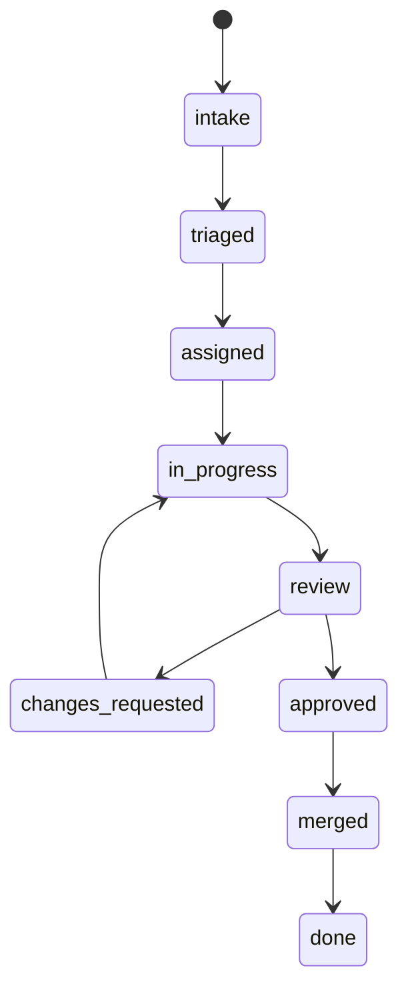

# CortexOS Agent Factory

> Role-driven automation system for routing issues, events, and reviews into scoped AI agent sessions.

## Contents

- [Concepts](#concepts)
- [Role files](#role-files)
- [State machine](#state-machine)
- [Dispatch flow](#dispatch-flow)
- [Review flow](#review-flow)
- [Related docs](#related-docs)

## Concepts

Agent factory maps work signals to role prompts. Roles live in `templates/agent-roles/`. Labels describe state. NATS and Slack carry events and narrative. OpenClaw executes scoped sessions.

## Role files

| Role | Typical responsibility |
|---|---|
| CEO | Strategic priority and final tradeoff decisions |
| CTO | Architecture, technical risk, platform direction |
| PM | Requirements, sequencing, acceptance criteria |
| QA | Test strategy, edge cases, regression risk |
| STAFF-ENG | Implementation quality, design review |
| CORTEX | Orchestration, triage, multi-agent coordination |

## State machine

Labels in `templates/labels.yml` should stay aligned with role routing and GitHub issue templates.

## Dispatch flow

1. Trigger arrives from GitHub, Slack, dashboard, or NATS.
2. Consumer normalizes payload.
3. Dispatch rule selects role and workspace.
4. Slack thread receives context and tracking marker.
5. OpenClaw gateway starts agent session.
6. Output is summarized back into Slack and, when relevant, NATS.

## Review flow

Antagonist review uses separate model or role to challenge assumptions, inspect risk, and block unsafe changes before merge.

## Related docs

- [Documentation index](README.md)
- [Architecture](ARCHITECTURE.md)
- [Security](SECURITY.md)
