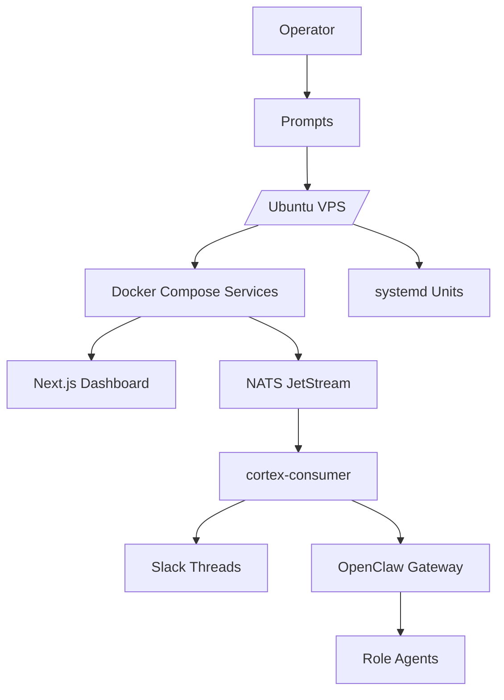
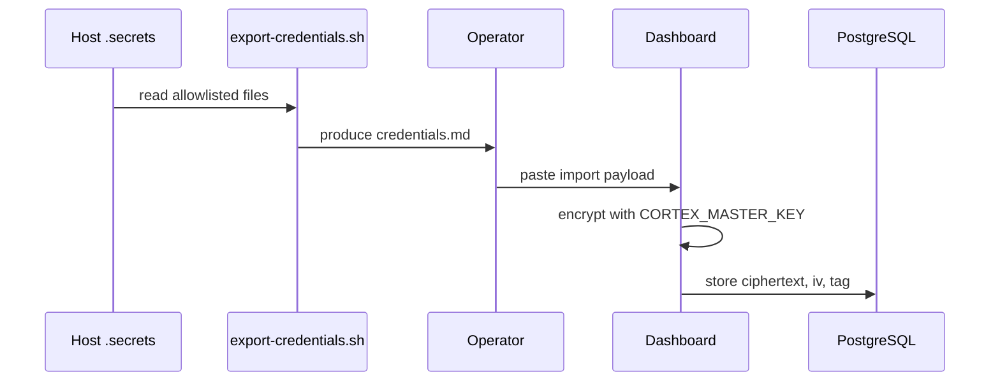

# CortexOS System Architecture

> Detailed technical design for single-host AI operations, observability, credentials, and agent orchestration.

## Contents

- [Overview](#overview)
- [Component map](#component-map)
- [Deployment flow](#deployment-flow)
- [Runtime flow](#runtime-flow)
- [Credential flow](#credential-flow)
- [Trust model](#trust-model)
- [Extension guide](#extension-guide)
- [Related docs](#related-docs)

## Overview

CortexOS deploys layered services onto one Ubuntu VPS. Operator executes prompt modules locally through AI agent. Modules write files under `CORTEX_ROOT` (default `/opt/cortexos`), install Docker stacks, configure systemd units, register dashboard services, and export credentials for encrypted dashboard import.

## Component map

```text
/opt/cortexos
  ├─ .secrets/              host-only secret files
  ├─ secrets/               dashboard and service env files
  ├─ stacks/                Docker Compose stacks
  ├─ data/                  persistent service data
  ├─ templates/             deployed scripts and role files
  └─ backups/               deployment and account backups
```



## Deployment flow

1. Operator sets `CORTEX_*` environment variables.
2. Agent executes numbered setup prompts.
3. Each prompt creates files, services, or registrations.
4. Prompt stops at checkpoint.
5. Operator verifies output.
6. Module 13 exports credentials into importable Markdown.
7. Dashboard imports and encrypts credentials.

## Runtime flow

- Husky hooks publish CI events to NATS.
- Dashboard publishes operational requests with approval metadata.
- `cortex-consumer` validates messages, posts Slack updates, and dispatches agents.
- OpenClaw gateway starts scoped role sessions.
- Agents report progress back through Slack or dashboard-controlled channels.

## Credential flow



## Trust model

| Area | Boundary | Control |
|---|---|---|
| Operator plane | SSH, Tailscale, dashboard admin | Authentication and host access |
| Secret files | `/opt/cortexos/.secrets` | File permissions, allowlist, masking |
| Agent actions | Gateway and role prompts | Scope, approvals, audit trail |
| Events | NATS subjects | HMAC where required, schema validation |

## Extension guide

Add new service by updating compose template, dashboard seed, observability scrape config, docs index, and troubleshooting entry. Add new agent by creating role file, label mapping, dispatch rule, and NATS contract entry.

## Related docs

- [Documentation index](README.md)
- [Architecture](ARCHITECTURE.md)
- [Security](SECURITY.md)
