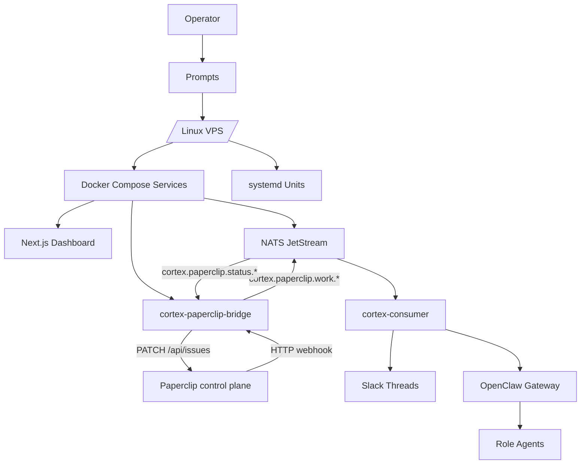
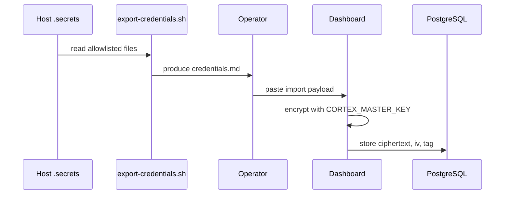

# CortexOS System Architecture

> Detailed technical design for single-host AI operations, observability, credentials, and agent orchestration.

## Contents

- [Overview](#overview)
- [Component map](#component-map)
- [Deployment flow](#deployment-flow)
- [Runtime flow](#runtime-flow)
- [Credential flow](#credential-flow)
- [Trust model](#trust-model)
- [Extension guide](#extension-guide)
- [Related docs](#related-docs)

## Overview

CortexOS deploys layered services onto one Ubuntu VPS. Operator executes prompt modules locally through AI agent. Modules write files under `CORTEX_ROOT` (default `/opt/cortexos`), install Docker stacks, configure systemd units, register dashboard services, and export credentials for encrypted dashboard import.

## Component map

```text
/opt/cortexos
  ├─ .secrets/              host-only secret files
  ├─ secrets/               dashboard and service env files
  ├─ stacks/                Docker Compose stacks
  ├─ data/                  persistent service data
  ├─ templates/             deployed scripts and role files
  └─ backups/               deployment and account backups
```



### Paperclip governance layer

Paperclip sits **above** CortexOS as the governance plane: it owns
goals, issues, approvals, and monthly budgets. The bridge service
(`stacks/cortex-paperclip-bridge`) translates Paperclip HTTP webhooks
into NATS work messages on `cortex.paperclip.work.<role>` and lifts
consumer status events back onto `PATCH /api/issues/:id`. The link
table `paperclip_ticket_link` (migration `005`) enforces idempotency via
`UNIQUE(paperclip_run_id)`. See [PAPERCLIP.md](PAPERCLIP.md) for the
full authority split, auth model, and ops runbook.

## Deployment flow

1. Operator sets `CORTEX_*` environment variables.
2. Agent executes numbered setup prompts.
3. Each prompt creates files, services, or registrations.
4. Prompt stops at checkpoint.
5. Operator verifies output.
6. Module 13 exports credentials into importable Markdown.
7. Dashboard imports and encrypts credentials.

## Runtime flow

- Husky hooks publish CI events to NATS.
- Dashboard publishes operational requests with approval metadata.
- `cortex-consumer` validates messages, posts Slack updates, and dispatches agents.
- OpenClaw gateway starts scoped role sessions.
- Agents report progress back through Slack or dashboard-controlled channels.

## Credential flow



## Trust model

| Area | Boundary | Control |
|---|---|---|
| Operator plane | SSH, Tailscale, dashboard admin | Authentication and host access |
| Secret files | `/opt/cortexos/.secrets` | File permissions, allowlist, masking |
| Agent actions | Gateway and role prompts | Scope, approvals, audit trail |
| Events | NATS subjects | HMAC where required, schema validation |

## Graph execution layer (V7)

The `cortex-graph` sidecar (`stacks/cortex-graph/`) introduces a
LangGraph-driven execution plane for any agent role whose template
frontmatter declares `graphEnabled: true`. The sidecar persists graph
checkpoints in the dashboard's Postgres instance
(`dashboard/migrations/007_langgraph_checkpoints.sql`) so a crash mid-run
preserves state. `cortex-consumer` POSTs to the sidecar's
`/graph/runs` HTTP endpoint when `CORTEX_GRAPH_URL` is set; legacy
direct dispatch is preserved for roles that opt out. NATS lifecycle
events flow on `cortex.graph.state.<runId>` using the V2 HMAC envelope.
See [AGENT-GRAPH.md](AGENT-GRAPH.md) for node contracts, resume
semantics, and the checkpoint lifecycle.

## Extension guide

Add new service by updating compose template, dashboard seed, observability scrape config, docs index, and troubleshooting entry. Add new agent by creating role file, label mapping, dispatch rule, and NATS contract entry.

## Related docs

- [Documentation index](README.md)
- [Paperclip integration](PAPERCLIP.md)
- [NATS contract](NATS-CONTRACT.md)
- [Security](SECURITY.md)
