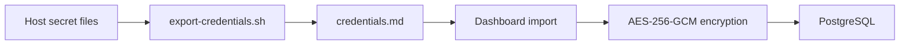

# CortexOS Credentials

> Credential lifecycle, encryption model, import flow, access policy, and rotation guidance.

## Contents

- [Principles](#principles)
- [Storage locations](#storage-locations)
- [Encryption model](#encryption-model)
- [Import flow](#import-flow)
- [Access controls](#access-controls)
- [Rotation](#rotation)
- [Related docs](#related-docs)

## Principles

- Secrets never enter git.
- Host `.secrets/` files are canonical during install.
- Dashboard stores imported values encrypted with AES-256-GCM.
- Reads are masked by default and audited.
- Rotation procedure must include verification and rollback note.

## Storage locations

| Location | Purpose |
|---|---|
| `/opt/cortexos/.secrets/*.env` | Service and stack credentials |
| `/opt/cortexos/.secrets/dashboard.env` | Dashboard runtime secrets |
| `~/.openclaw/openclaw.json` | OpenClaw account config |
| PostgreSQL credentials tables | Encrypted dashboard credential store |

## Encryption model

Dashboard uses `CORTEX_MASTER_KEY` from `/opt/cortexos/.secrets/dashboard.env`. Each credential field is encrypted with AES-256-GCM and stored as ciphertext, IV, and authentication tag. Master key compromise enables decryption, so host file permissions and backups matter.

## Import flow

## Access controls

- Admin session required for dashboard credential views.
- Reveal actions require confirmation token.
- File reads use allowlisted roots only.
- Audit rows record user, action, path or slug, and timestamp.

## Rotation

1. Generate replacement secret.
2. Update source service env file.
3. Restart affected service.
4. Verify health and dependent workflows.
5. Re-export and re-import credentials if dashboard copy changed.
6. Remove old value from backups where feasible.

## Related docs

- [Documentation index](README.md)
- [Architecture](ARCHITECTURE.md)
- [Security](SECURITY.md)
