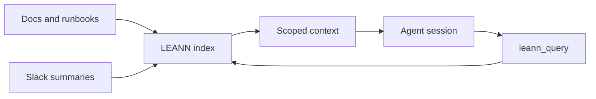

# CortexOS Memory

> LEANN-backed retrieval architecture for operational memory, agent context, and project knowledge.

## Contents

- [Overview](#overview)
- [Data flow](#data-flow)
- [Storage](#storage)
- [Query policy](#query-policy)
- [Operations](#operations)
- [Related docs](#related-docs)

## Overview

CortexOS uses memory services to help agents retrieve prior decisions, runbooks, repository context, and operational notes. Memory augments Slack narrative and docs; it does not replace source-of-truth files.

## Data flow

## Storage

Indexes live under `/opt/cortexos/data/leann/`. Backups should include index metadata when memory is considered operationally important.

## Query policy

- Query only for task-relevant context.
- Prefer source files for authoritative current state.
- Do not store secrets in memory.
- Treat retrieved content as advisory until verified against repository or host.

## Operations

Health is checked by LEANN module prompts. If retrieval fails, agents should continue from docs and Slack rather than blocking critical operations.

## Related docs

- [Documentation index](README.md)
- [Architecture](ARCHITECTURE.md)
- [Security](SECURITY.md)
