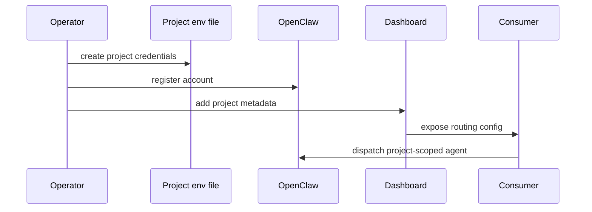

# CortexOS Project Bots

> Registration model for per-project Slack, Telegram, and OpenClaw bot credentials.

## Contents

- [Overview](#overview)
- [Credential file](#credential-file)
- [Registration flow](#registration-flow)
- [Audit](#audit)
- [Related docs](#related-docs)

## Overview

Project bots isolate credentials and messaging routes per repository or workstream. Each project receives env file under `/opt/cortexos/.secrets/projects/<slug>.env` and routing metadata in dashboard or consumer config.

## Credential file

```bash
cat > /opt/cortexos/.secrets/projects/<slug>.env <<'EOF'
OPENCLAW_ACCOUNT_<SLUG>=<account-slug>
TELEGRAM_BOT_TOKEN=<token>
SLACK_BOT_TOKEN=<token>
SLACK_CHANNEL_ID=<channel>
SLACK_THREAD_TS=<thread-ts>
EOF
chmod 600 /opt/cortexos/.secrets/projects/<slug>.env
```

## Registration flow



## Audit

Reads are masked and logged in `agent_gateway_audit`. Reveal or edit operations should require admin session and confirmation.

## Related docs

- [Documentation index](README.md)
- [Architecture](ARCHITECTURE.md)
- [Security](SECURITY.md)
